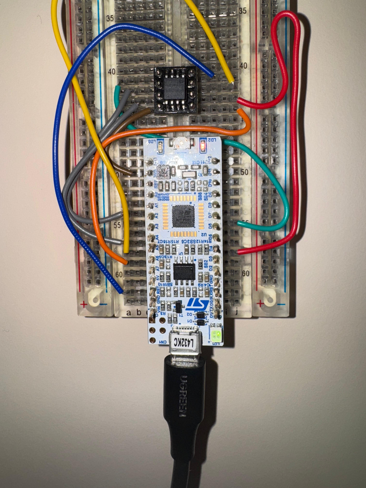

# Writing the first bytes to the FLASH

**Steps:**

0. Physically Connect the FLASH
1. Configure the STM32 QUADSPI Peripheral
2. Configure the FLASH
3. Write to FLASH
4. Verify

**Components Used**
- STM32L432KC Nucleo Board
- STM32 Software (CubeMX and IDE)
- GD25Q32C FLASH

## Physical Connection

## Physical Connection STM
| Nucleo32 Pin Name | Signal on Pin   | GD25Q32C Flash Connection | Flash1 Breakout Pin (top-right) # | Flash2 Breakout Pin (bottom-left) # | Nucleo32 Arduino Label | Wire Color |
| :---------------- | :-------------- | :------------------------ | :-------------------- | :-------------------- | :--------------------- | :--------- | 
| PA2               | QUADSPI_BK1_NCS | CS# (Chip Select)         | 5                     | 1                     | A7                     | **Orange** |
| PA3               | QUADSPI_CLK     | SCLK (Serial Clock)       | 2                     | 6                     | A2                     | **Grey**   | 
| PA6               | QUADSPI_BK1_IO3 | HOLD# (IO3)               | 3                     | 7                     | A5                     | **Grey**   | 
| PA7               | QUADSPI_BK1_IO2 | WP# (IO2) (Write Protect) | 7                     | 3                     | A6                     | **Yellow** | 
| PB0               | QUADSPI_BK1_IO1 | SO (IO1) / DO             | 6                     | 2                     | D3                     | **Red**    | 
| PB1               | QUADSPI_BK1_IO0 | SI (IO0) / DI             | 1                     | 5                     | D6                     | **Green**  | 
| -                 | VCC             | VCC (Power)               | 4                     | 8                     | 3.3V                   | **Brown**  | 
| -                 | GND             | VSS (Ground)              | 8                     | 4                     | GND                    | **Blue**   |

### FPGA (DE10) Connections

| **Wire**      | **De-10 Pin name** | **Color** | **DE-10 Pin** |
| ------------- | ------------ | --------- | ------------- |
| xip_csn       | GPIO 7       | Grey      | PIN_AH3       |
| xip_sck       | GPIO 8       | Purple    | PIN_AH4       |
| flash_io[0]   | GPIO 9       | Blue      | PIN_AH5       |
| flash_io[1]   | GPIO 10      | Green     | PIN_AG1       |
| flash_io[2]   | GPIO 11      | Yellow    | PIN_AG2       |
| flash_io[3]   | GPIO 12      | Orange    | PIN_AG3       |

## STM32 QUADSPI Peripheral Configuration
- Make STM32Cube Project Then disable the default USART2 to solve the pin conflicts with QUADSPI Peripheral
- Enable the QaudSPI Mode of the QUADSPI Peripheral as "Bank1 with Quad SPI Lines"
- Set the paremeters to the following

| Parameter | Value |
| :--- | :--- |
| Clock Prescaler | 1 |
| Fifo Threshold | 1 |
| Sample Shifting | No Sample Shifting |
| Flash Size | 21 |
| Chip Select High Time | 1 Cycle |
| Clock Mode | Low |
| Flash ID | Flash ID 1 |
| Dual Flash | Disabled |

- The default GPIO mapping will be (except that I edited the Chip Selector Pin to use Pull-up configuration)

| Pin Name | Signal on Pin | GPIO output level | GPIO mode | GPIO Pull-up/Pull-down | Maximum output speed | Fast Mode | User Label | Modified |
| :--- | :--- | :--- | :--- | :--- | :--- | :--- | :--- | :--- |
| PA2 | QUADSPI_BK1_NCS | n/a | Alternate Function Push Pull | Pull-up | Very High | n/a | | [x] |
| PA3 | QUADSPI_CLK | n/a | Alternate Function Push Pull | No pull-up and no pull-down | Very High | n/a | | [ ] |
| PA6 | QUADSPI_BK1_IO3 | n/a | Alternate Function Push Pull | No pull-up and no pull-down | Very High | n/a | | [ ] |
| PA7 | QUADSPI_BK1_IO2 | n/a | Alternate Function Push Pull | No pull-up and no pull-down | Very High | n/a | | [ ] |
| PB0 | QUADSPI_BK1_IO1 | n/a | Alternate Function Push Pull | No pull-up and no pull-down | Very High | n/a | | [ ] |
| PB1 | QUADSPI_BK1_IO0 | n/a | Alternate Function Push Pull | No pull-up and no pull-down | Very High | n/a | | [ ] |

or more concisely

| Pin Name | Signal on Pin |
| :--- | :--- |
| PA2 | QUADSPI_BK1_NCS |
| PA3 | QUADSPI_CLK |
| PA6 | QUADSPI_BK1_IO3 |
| PA7 | QUADSPI_BK1_IO2 |
| PB0 | QUADSPI_BK1_IO1 |
| PB1 | QUADSPI_BK1_IO0 |

## Configure the FLASH
1. Send Write Enable (WREN) Command to the FLASH. The WREN Command is `0x06`
2. The previous command will set a bit called WEL Bit
3. Verify that the WEL (Write Enable Latch) bit is set in the Status Register by reading it. 