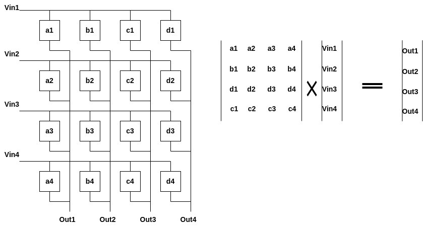

# In-Memory Computing (IMC) with ReRAM

## The Core Mechanism

Neuromorphic computing uses ReRAM to perform math directly where the data is stored. It exploits **Ohm’s Law** and **Kirchhoff’s Current Law** to execute Matrix-Vector Multiplication (MVM) at the physical level.

* **Input ($V$):** Represented as **Voltage** applied to the horizontal rows.
* **Weights ($G$):** Stored as **Conductance** ($G = 1/R$) within each ReRAM cell.
* **Output ($I$):** Resulting **Current** summed at the bottom of each vertical column.

### The Physics of the Calculation

1. **Multiplication:** As voltage passes through a cell, the current produced is $I = V \times G$ (Ohm's Law).
2. **Addition:** All currents in a single column merge together naturally (Kirchhoff’s Law).

---

## Matrix Multiplication Mapping

In the crossbar array below, each box represents a memory cell. The labels ($a1, b1, c1, d1$, etc.) represent the specific conductance value of that cell.

*Figure 2: 4x4 Crossbar array mapping math to hardware.*

The output for each column (e.g., **Out1**) is the dot product of the input vector and the weight column:

$$Out_1 = (V_{in1} \cdot a_1) + (V_{in2} \cdot a_2) + (V_{in3} \cdot a_3) + (V_{in4} \cdot a_4)$$

### Why this is "Neuromorphic"

* **Efficiency:** Computation happens at the speed of electricity; no data is moved between a CPU and RAM.

## Mapping Numbers to Physical Quantities

To do math in a brain-like way, we have to translate abstract numbers into real-world physical values. Here is how that "feeling" is captured in the hardware:

| Mathematical Value | Physical Property | Realistic Example |
| :--- | :--- | :--- |
| **Weights** | **Conductance ($G$)** | A weight of **1,253** is mapped to **12.53 $\mu S$** (microsiemens) by varying the filament thickness. |
| **Input Data** | **Voltage ($V$)** | An input pixel value of **5** (on a 0-255 scale) is converted to a pulse of **0.05 V**. |
| **Result** | **Current ($I$)** | The final answer is the **total current** (e.g., **62.65 $\mu A$**) measured at the bottom of the column. |

### The Precision Reality Check
To be honest, this system is not a "calculator" in the traditional sense. It faces significant physical challenges:
* **Analog Noise & Drift:** Unlike digital bits (exactly 0 or 1), a ReRAM filament can "drift" or change slightly due to heat or wear. Your weight of 12.53 $\mu S$ might naturally become 12.54 $\mu S$ over time.
* **The "Close Enough" Trade-off:** We sacrifice **mathematical exactness** (precision) for **extreme energy efficiency**. 
* **Use Case:** This makes ReRAM perfect for **AI and Pattern Recognition**—where a 98% correct "feeling" is enough—but it is fundamentally unsuitable for banking or encryption where every decimal must be perfect.